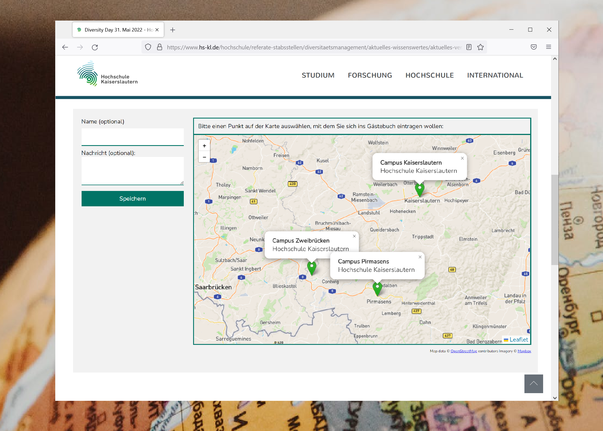

# openguestmapbook 🗺
A simple guestbook with a simple database in the background for websites that shows location, name and message of visitors if they set it on a map.

`This project was developed because there are no lightweight solutions for free on the market for such a use case!`

This small project is not optimized for direct implementation as there are some values hard-coded, but it should be fairly easy to remove those if you wish to use this project. I am also here to help :D

---
### Here's an image of the guestbook in action:

Project is using:
* Leaflet (for the map)
* SQL (database)
* HTML, JS, CSS (frontend)
* php (post, get --> dp)

---

Move along ;)